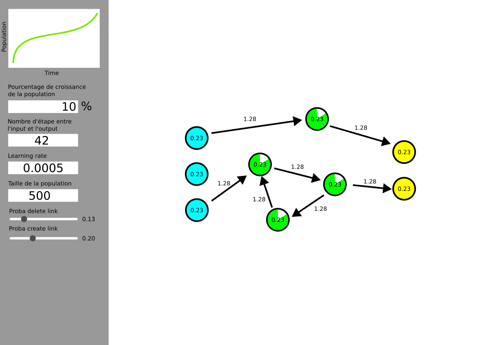

# Genetic Network Generator

L'objectif de ce script est d'adopter une approche connexionniste à la génération de réseaux de neurones. Plutôt que d'instancier un modèle global à entraîner, nous voulons considérer chaque neurone comme une entité distincte, avec une espérance de vie. Pour survivre, chaque neurone doit limiter son taux d'erreur. L'algorithme utilise une descente de gradient classique pour minimiser son coût. Cependant, à chaque fin d'époque, les neurones ayant fait le plus d'erreurs sont éliminés, et les meilleurs neurones se reproduisent.

## Utilisation

1. Définissez les différents paramètres dans l'interface.

2. Appuyez sur le bouton "Run Network" pour exécuter le programme.

## Licence

Ce projet est sous licence [LICENSE](LICENSE).
